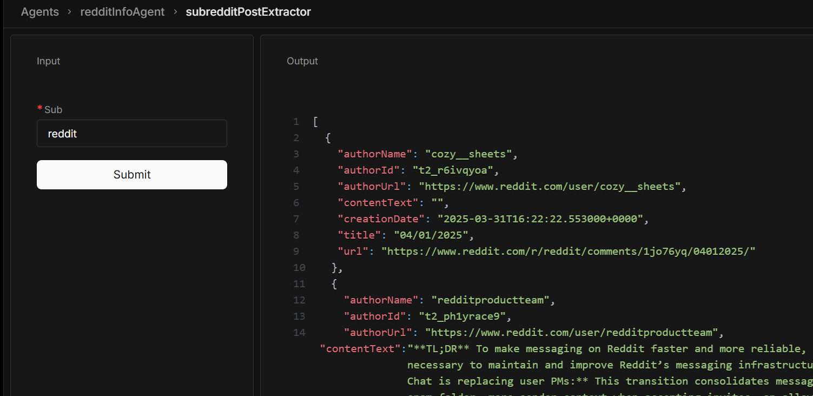
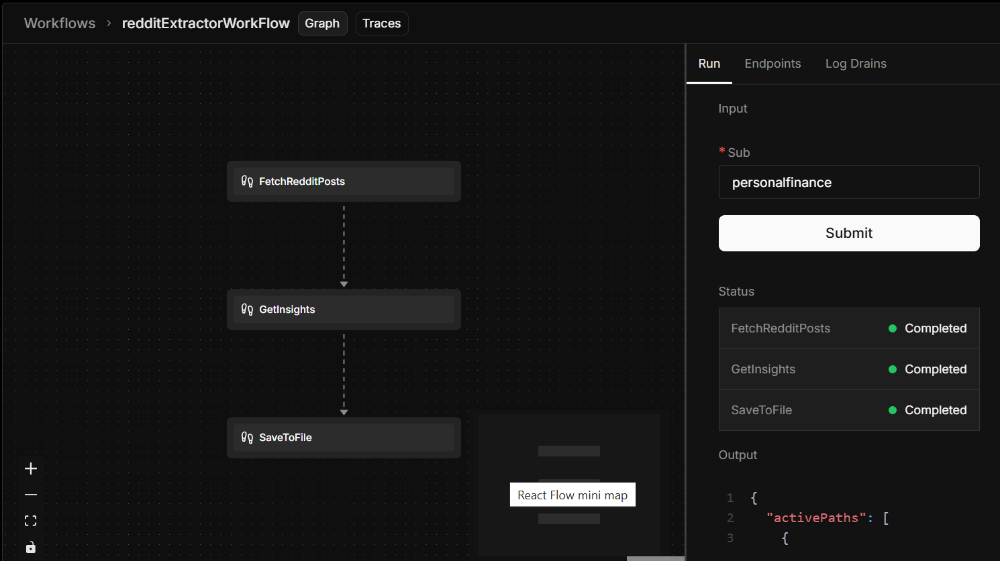

## Reddit Agent

Fetch posts from a Reddit sub and analyze them with AI.

### Why?

**Scenario:** Market Research for a New Product Launch

**Context:** Imagine a company, "TechInnovate," is developing a new noise-canceling headphone designed specifically for gamers. They want to understand the current sentiment and needs of their target audience (gamers) before launching the product. Rather than relying on assumptions or expensive surveys, they decide to leverage the vast, real-time data available on Reddit.
<br /> <br />


This data is then loaded into your workflow where you define what you want to extract from it (Sentiment analysis).

<br /> <br />



### Technical Details

- **Language:** NodeJS
- **APIs:** RapidAPI-Reddit
- **Data Source:** Reddit API.

### Benefits

- Provides real-time insights into user sentiment and needs.
- Offers a cost-effective alternative to traditional market research.
- Allows for data driven product development.
- Can be used for ongoing product monitoring.

### Usage

1.  **Configuration:** Add check env.example for needed API keys. e.g RapidAPI and OpenAI/Google.
2.  **Execution:** Pull repo and install packages e.g bun install then run bunx/npx mastra dev
3.  **Output:** The agent returns a JSON file containing the extracted posts, sentiment scores, identified topics, and extracted keywords.

### Output Data Example.

```json
[
  {
    "authorName": "trat_la",
    "authorId": "t2_eillqiu9",
    "authorUrl": "https://www.reddit.com/user/trat_la",
    "contentText": "We know this is normally the place for Reddit product, platform, and ~~Oscar’s~~ updates, so if you want to see Reddit, Inc. investor-related news and content, head on over to r/RDDT. Spoiler alert: as a community, r/RDDT will have regulatory limitations and operate slightly differently ([lawyercat](https://i.redd.it/p6bk2mmlxjoc1.gif)).",
    "creationDate": "2024-03-21T17:28:58.245000+0000",
    "title": "Introducing a new community: r/RDDT",
    "url": "https://www.reddit.com/r/reddit/comments/1bkc508/introducing_a_new_community_rrddt/"
  }
  // ... more posts
]
```

You can then run this data through more workflows. e.g extract data then do a sentiment analysis. The Agent also has memory and will remember past conversations.
